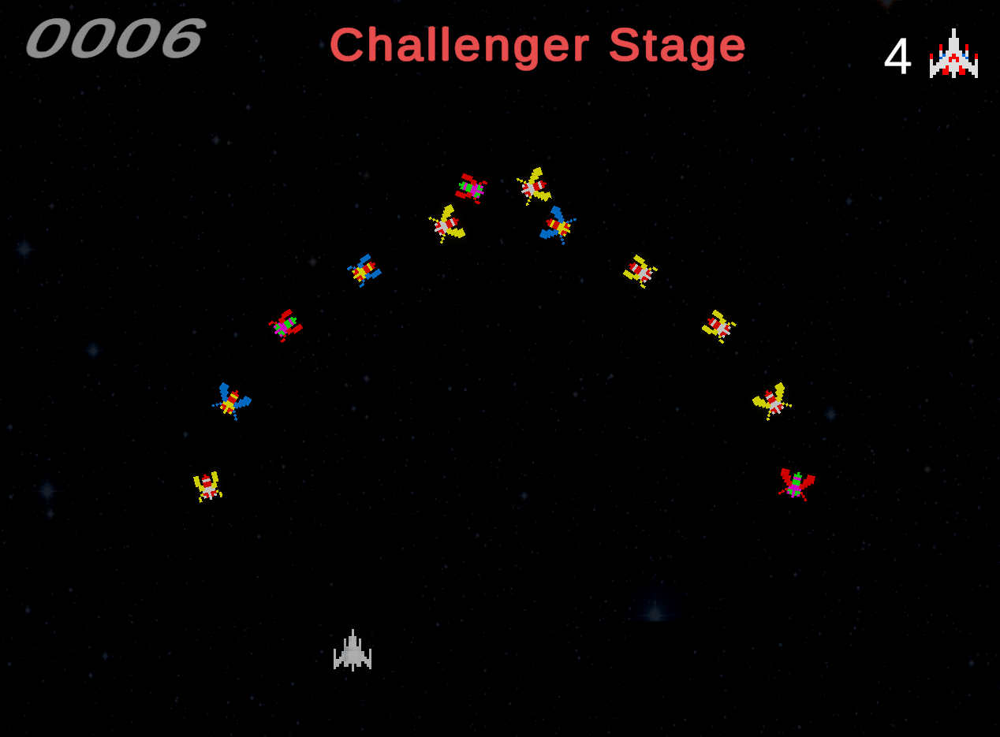
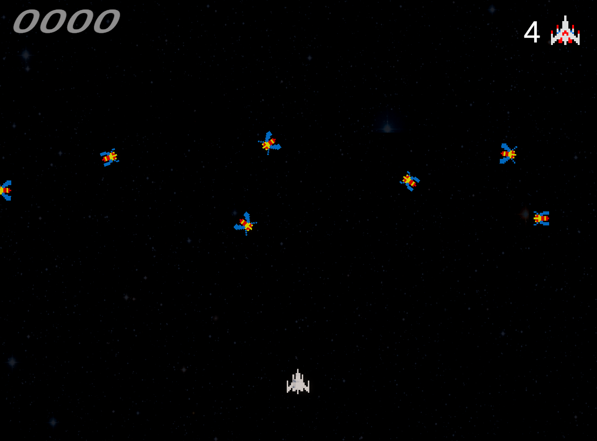
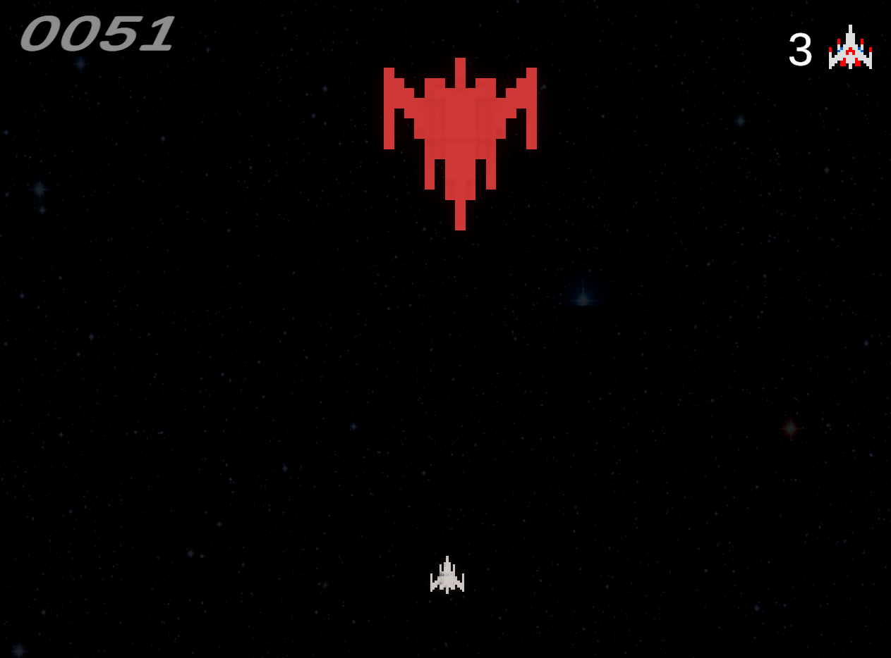
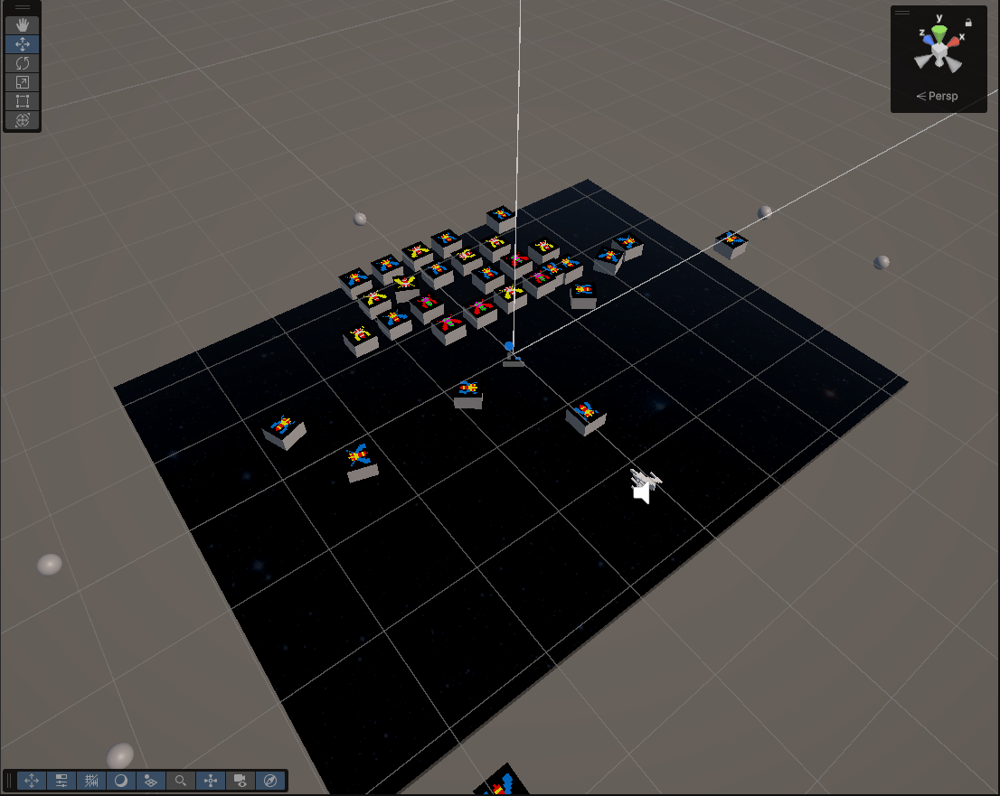

# MatchBook – Book Recommendation App

## Gameplay Preview

    

## Screenshots

    
    
    
    

---

## Galaga Recreation

This unity game was meant to serve as a recreation to the 1981 fixed shooter developed by Namco. It's obviously not a true copy, we just wanted to create something similarily feeling. 
This game features three unique stages and a boss fight. 

---

## Features

**Components**
  - Entry stage, challenger stage, boss fight and bonus stage. 
  - Multi-stage Dyanmic enemies
  - Shooting Mechanics
  - Original Sound Effects 1981
  - Health and point system
---

## Author

**Justin Kadyrov, Aman Purohit, Jeffrey Pincombe**  
Game Development
